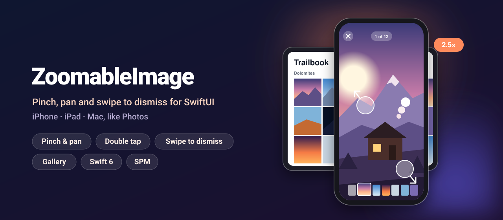
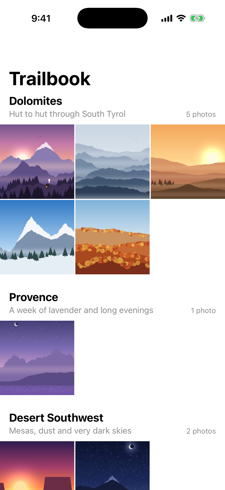
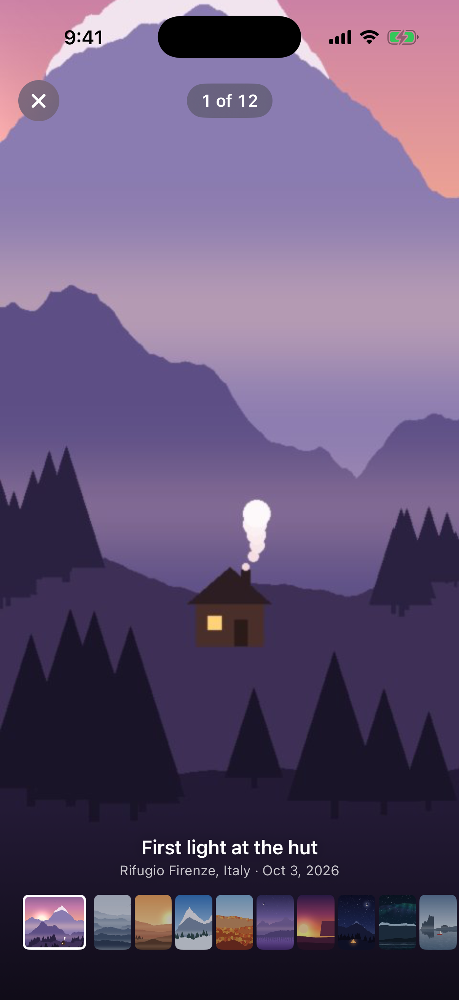
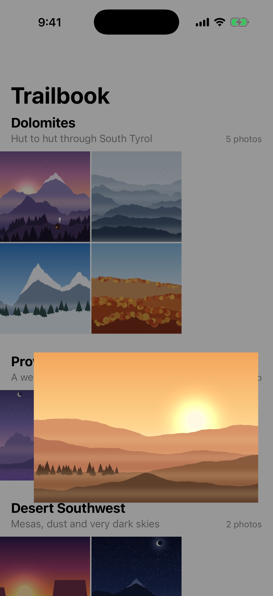
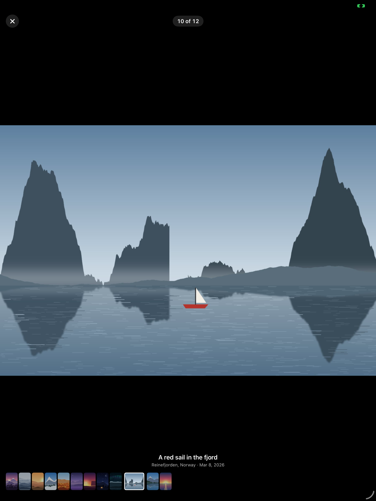
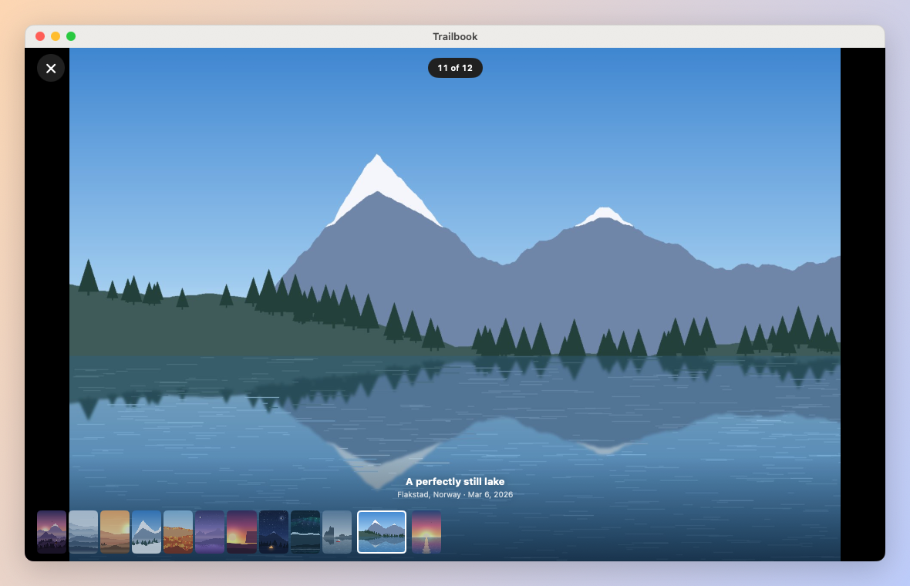

<p align="center">
  
</p>

<p align="center">
  <a href="https://github.com/halilozel1903/ZoomableImage/actions/workflows/ci.yml"></a>
  
  
  
  
  
  <a href="LICENSE"></a>
</p>

**ZoomableImage** is the image viewer of Photos for your SwiftUI app: **pinch to zoom, double tap, pan, swipe down to dismiss** and a **paging gallery with a thumbnails strip** that grows out of your grid and shrinks back into it. It works with touch on iPhone and iPad and with the trackpad, scroll wheel and mouse on the Mac. All of the zoom math (rubber-banding, anchor-preserving zoom, pan limits, double tap targets, dismiss thresholds) is plain, unit-tested Swift.

```swift
ZoomableImage(image: Image("Summit"))

ContentGrid()
    .imageGallery(items: photos, selection: $selection, namespace: namespace) { photo in
        .url(photo.url)
    }
```

## Screenshots

Captured from the example app, *Trailbook*, on iOS 26 simulators and macOS 26 by CI.

| Grid | Zoomed in | Swipe to dismiss |
| :---: | :---: | :---: |
|  |  |  |

On iPad the gallery shows a caption and a strip of thumbnails:

<p align="center">
  
</p>

And on the Mac you zoom with the trackpad, ⌥ Option + scroll or a double click:

<p align="center">
  
</p>

## Features

- **Pinch to zoom** around your fingers, with rubber-band resistance past the minimum and maximum scale and a spring back when you let go.
- **Double tap** (double click on the Mac) to zoom in on exactly the detail you tapped, and again to zoom out.
- **Pan** a zoomed image with momentum. The image edges never leave the view's edges: it stops at the edge and rubber-bands if you pull further.
- **Swipe down to dismiss**: the image follows your finger and shrinks while the background fades. A long enough drag or a quick flick closes it, and flicking back cancels.
- **Gallery**: `ImageGallery` pages through your images with a swipe, keeps the zoom per page, resets it when you move on and shows a **thumbnails strip**, a counter and your own caption view.
- **Matched-geometry transition**: the photo grows out of its grid cell and lands back in it, even after you paged to another photo.
- **Async loading**: show an `Image`, a web or file `URL`, or anything your own async closure returns, with a placeholder while it loads and a shared in-memory cache.
- **Mac**: trackpad pinch, ⌥ Option + scroll wheel to zoom around the pointer, scroll or drag to pan, double click, arrow keys to page and Escape to close.
- **Fit or fill**: start with the whole image visible (`.fit`) or covering the view (`.fill`), and pan the overflow.
- **Open zoomed in**: `initialZoom` shows a detail first, such as a face in a group photo.
- **Accessibility**: images are labeled, a "Zoom in" / "Zoom out" action replaces the double tap for VoiceOver, and the gallery buttons have labels.
- **Pure, tested math**: `ZoomState`, `DismissState`, `GalleryPaging` and `ZoomMath` have no view code and are covered by Swift Testing.
- **Swift 6 strict concurrency**, zero dependencies.

## Installation

In Xcode choose **File › Add Package Dependencies…** and enter:

```
https://github.com/halilozel1903/ZoomableImage
```

Or add it to `Package.swift`:

```swift
dependencies: [
    .package(url: "https://github.com/halilozel1903/ZoomableImage", from: "1.0.0")
]
```

## Quick start

A photo grid that opens a gallery, Photos style:

```swift
import SwiftUI
import ZoomableImage

struct Photo: Identifiable {
    let id: String
    let url: URL
    let thumbnailURL: URL
    let title: String
}

struct PhotoGrid: View {
    let photos: [Photo]
    @State private var selection: Photo.ID?
    @Namespace private var namespace

    var body: some View {
        NavigationStack {
            ScrollView {
                LazyVGrid(columns: [GridItem(.adaptive(minimum: 110), spacing: 2)], spacing: 2) {
                    ForEach(photos) { photo in
                        Color.clear
                            .aspectRatio(1, contentMode: .fit)
                            .overlay { LoadableImage(source: .url(photo.thumbnailURL), contentMode: .fill) }
                            .clipped()
                            .galleryTransitionSource(id: photo.id, selection: selection, in: namespace)
                            .onTapGesture {
                                withAnimation(.spring(response: 0.42, dampingFraction: 0.86)) {
                                    selection = photo.id
                                }
                            }
                    }
                }
            }
            .navigationTitle("Photos")
        }
        .imageGallery(
            items: photos,
            selection: $selection,
            namespace: namespace,
            source: { .url($0.url) },
            thumbnail: { .url($0.thumbnailURL) }
        ) { photo in
            Text(photo.title).font(.headline)               // shown above the thumbnails
        }
    }
}
```

`selection` follows the page on screen and becomes `nil` when the gallery closes (close button, swipe down or Escape).

## Usage

### A single zoomable image

```swift
ZoomableImage(image: Image("Summit"))

ZoomableImage(url: URL(string: "https://example.com/summit.jpg")!)

ZoomableImage(
    source: .provider(id: asset.localIdentifier) {
        try await photoLibrary.fullImage(for: asset)      // any async code that returns an Image
    },
    placeholder: { ProgressView("Loading…") }             // your own placeholder
)
```

### Swipe to dismiss

Give it an `onDismiss` action and, if you want, a binding that follows the swipe so your own background can fade:

```swift
@State private var showsPhoto = true
@State private var dismissProgress: CGFloat = 0

ZStack {
    Color.black.opacity(1 - dismissProgress).ignoresSafeArea()
    ZoomableImage(image: Image("Summit"), dismissProgress: $dismissProgress) {
        showsPhoto = false
    }
}
```

Without `onDismiss`, swiping does nothing and vertical drags on an image that is not zoomed in reach an enclosing `ScrollView`.

### Configuration

```swift
var configuration = ZoomConfiguration()
configuration.maximumScale = 6                      // default 4
configuration.doubleTapScale = 3                    // default 2.5
configuration.contentMode = .fill                   // cover the view, pan the overflow
configuration.scaleOvershoot = 0.2                  // how far a pinch may go past the limits
configuration.rubberBandsEdges = false              // hard stop at the edges
configuration.dismissal.allowsUpwardSwipe = true    // swipe up or down to close
configuration.dismissal.distanceThreshold = 100

ZoomableImage(image: image, configuration: configuration, initialZoom: ZoomTarget(scale: 2.5, anchor: CGPoint(x: 0.64, y: 0.3)))
```

| `ZoomConfiguration` | Default | Meaning |
| --- | --- | --- |
| `minimumScale`, `maximumScale` | 1, 4 | Where gestures settle. 1 is the fitted (or filled) image. |
| `doubleTapScale` | 2.5 | The scale a double tap zooms to. |
| `contentMode` | `.fit` | `.fit` shows the whole image, `.fill` covers the view. |
| `scaleOvershoot` | 0.35 | A pinch can go 35% past a limit, with growing resistance. |
| `rubberBandsEdges` | `true` | Rubber-band or stop hard when panning past an edge. |
| `dismissal.distanceThreshold` | 120 pt | A release this far down closes the viewer. |
| `dismissal.velocityThreshold` | 700 pt/s | A flick this fast closes it from a shorter distance. |
| `dismissal.fadeDistance` | 320 pt | The distance over which the background fades out. |
| `dismissal.minimumContentScale` | 0.7 | How small the image gets while it is dragged. |
| `dismissal.allowsUpwardSwipe` | `false` | Whether a swipe up closes too. |

### Gallery

Use the modifier, or place `ImageGallery` yourself:

```swift
ImageGallery(
    items: photos,
    selection: $selection,
    namespace: namespace,           // optional: the grid-to-viewer transition
    showsThumbnails: true,
    source: { .url($0.url) },
    thumbnail: { .url($0.thumbnailURL) }
) { photo in
    PhotoCaption(photo: photo)
}
```

| Gesture | iPhone and iPad | Mac |
| --- | --- | --- |
| Zoom | Pinch, double tap | Trackpad pinch, ⌥ + scroll, double click |
| Pan | Drag (with momentum) | Drag, scroll |
| Next or previous image | Swipe left or right, tap a thumbnail | Drag, ← →, click a thumbnail |
| Show or hide the controls | Tap | Click |
| Close | Swipe down, close button | Drag down, close button, Escape |

### Any view

`ZoomableView` and `.zoomable()` add the same gestures to any content, such as a map snapshot or a PDF page rendered into a view:

```swift
TrailMap(trail: trail)
    .aspectRatio(3 / 2, contentMode: .fit)
    .zoomable()
```

### Loading images

`ZoomableImageSource` is what every view takes:

```swift
.image(Image("Summit"))                                  // ready to draw
.asset("Summit")                                          // from the asset catalog
.url(URL(string: "https://example.com/summit.jpg")!)     // downloaded with URLSession
.url(Bundle.main.url(forResource: "summit", withExtension: "jpg")!)   // read off the main thread
.provider(id: "summit") { try await loadSummit() }       // your own async loader
.uiImage(uiImage)   /   .nsImage(nsImage)
```

URL and provider images are cached in memory by URL or id, so a thumbnail loaded for the grid and the full image loaded for the viewer are each loaded once. `LoadableImage` shows a source without zooming, for grid cells:

```swift
LoadableImage(source: .url(photo.thumbnailURL), contentMode: .fill)

LoadableImage(source: .url(photo.url)) { phase in
    switch phase {
    case .success(let image): image.resizable().scaledToFit()
    case .empty: ProgressView()
    case .failure: Image(systemName: "photo")
    }
}
```

### The math

Every gesture is a few lines of view code around pure functions you can use and test on their own:

```swift
let state = ZoomState(
    contentSize: CGSize(width: 400, height: 300),     // the fitted image
    viewportSize: CGSize(width: 400, height: 800)
)

state.doubleTapTarget(at: CGPoint(x: 350, y: 400))    // scale 2.5, offset (-225, 0): the tapped point stays put
state.zoomed(to: 6, anchor: pinchCenter).settled()    // back to 4x, edges inside the view
state.rubberBandedScale(6)                            // 4.62: resistance past the maximum
state.maximumOffset(at: 4)                            // (600, 200): how far the image can be panned
state.zoomed(to: ZoomTarget(scale: 2.5, anchor: CGPoint(x: 0.75, y: 0.5)))   // a detail, centered

ZoomMath.fitSize(for: CGSize(width: 4000, height: 3000), in: CGSize(width: 390, height: 844))   // 390 × 292.5
ZoomMath.rubberBand(100, dimension: 400)              // 48.4, the UIScrollView formula

let drag = DismissState(translation: CGSize(width: 0, height: 160))
drag.progress                                         // 0.5
drag.shouldDismiss(velocity: CGSize(width: 0, height: 900))   // true

GalleryPaging.targetIndex(current: 2, count: 12, predictedEndTranslation: -250, pageWidth: 400)   // 3
```

## How it works

The image is laid out at its fitted (or filled) size in the middle of the view and measured. A `ZoomState` holds the scale and the offset of its center; the view draws it with `scaleEffect` and `offset`. All gestures are attached to the untransformed container, so their locations are in view coordinates and go straight into the math:

| Input | Math |
| --- | --- |
| `MagnifyGesture` | `zoomed(to: rubberBandedScale(start × magnification), anchor: startLocation)`, then `settled(anchor:)` with a spring |
| `DragGesture` on a zoomed image | `panned(from:by:)` with rubber-banding, then `clampedOffset(predictedEnd)` for momentum |
| `DragGesture` on an image that is not zoomed | mostly vertical: `DismissState`; mostly horizontal in a gallery: `GalleryPaging` |
| Double tap or click | `doubleTapTarget(at:)` |
| ⌥ + scroll (Mac) | `zoomed(to:anchor:)` around the pointer; plain scrolling pans |

A drag is only claimed when it does something (zoomed in, in a gallery, or with an `onDismiss`), so a `ZoomableImage` inside a `ScrollView` does not block scrolling.

## Example app

The `Example` folder contains *Trailbook*, a made-up photo journal for iPhone, iPad and Mac with twelve landscapes (drawn by a script, no real photos) grouped by trip. Tap a photo to open the gallery. It uses [XcodeGen](https://github.com/yonaskolb/XcodeGen) so no project file has to live in the repo:

```bash
brew install xcodegen
cd Example && xcodegen generate
open ZoomableImageDemo.xcodeproj
```

Run the `ZoomableImageDemo` scheme on an iPhone or iPad simulator, or `ZoomableImageDemoMac` on the Mac. Launch with `-screenshot grid|zoomed|dismiss|gallery|viewer` to see the scenes of the screenshots above.

## Requirements

- Xcode 26 or later (Swift 6.2 toolchain)
- iOS 17+, iPadOS 17+, macOS 14+

## Contributing

Issues and pull requests are welcome. Please run `swift test` before opening a PR.

## License

ZoomableImage is available under the MIT license. See [LICENSE](LICENSE).
